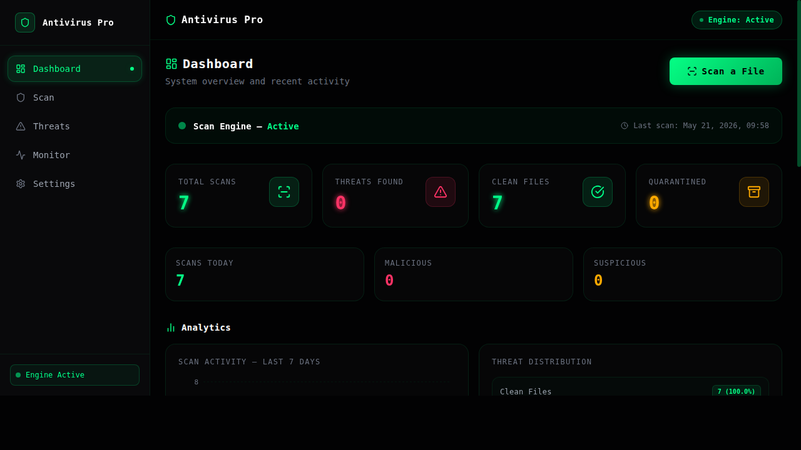
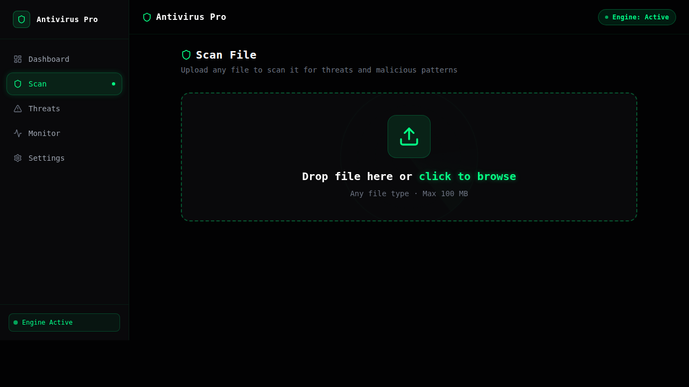
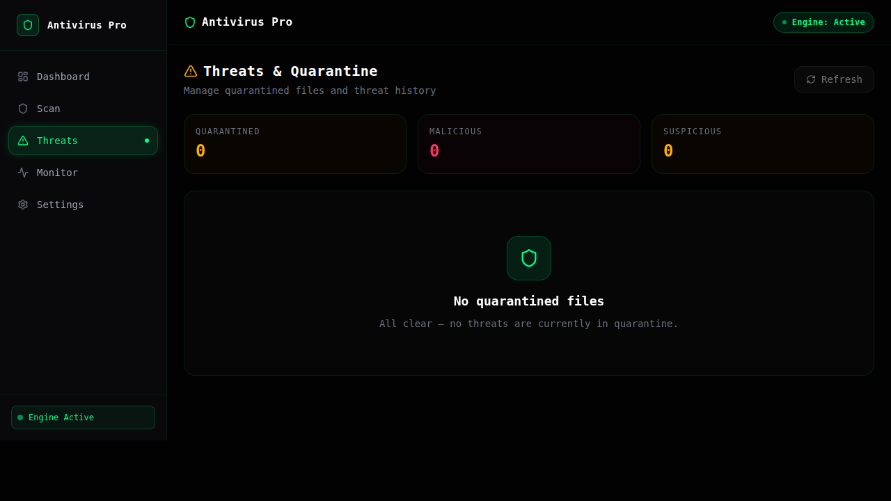
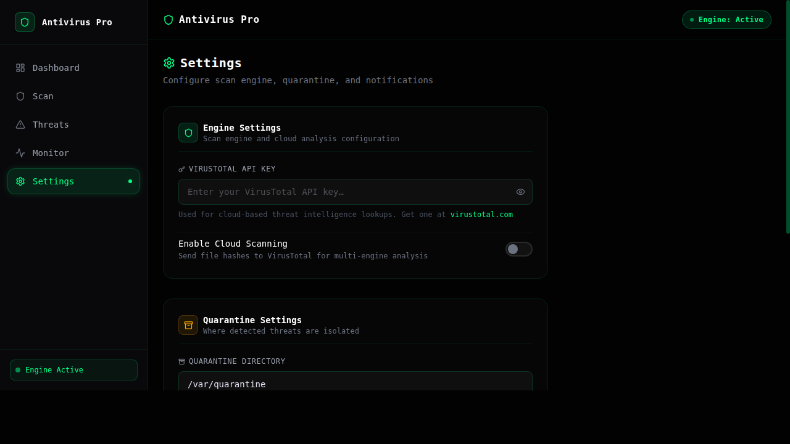
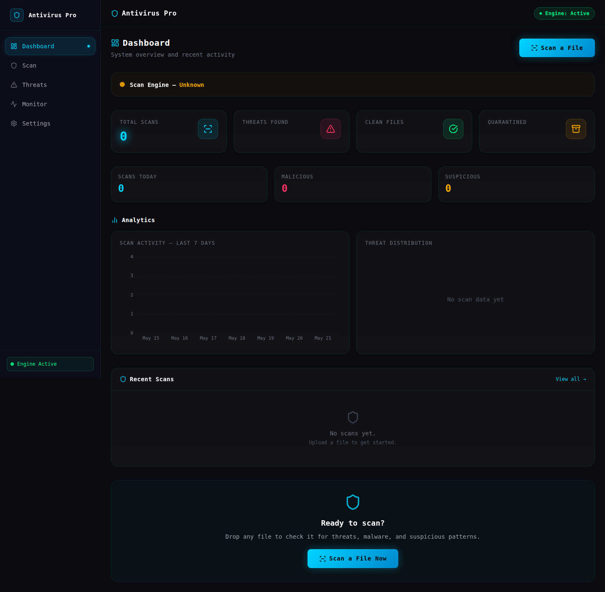
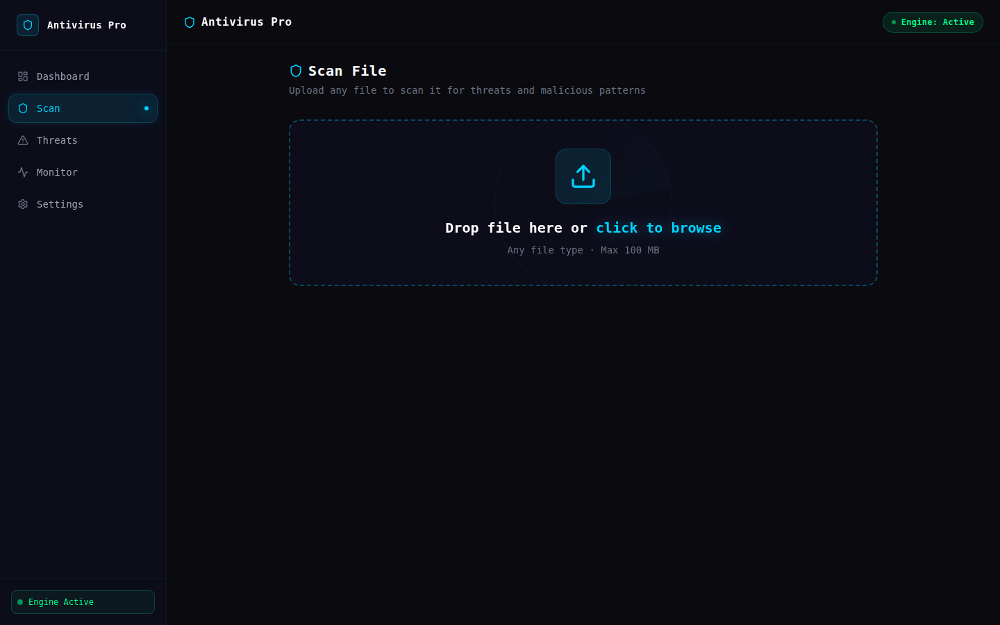
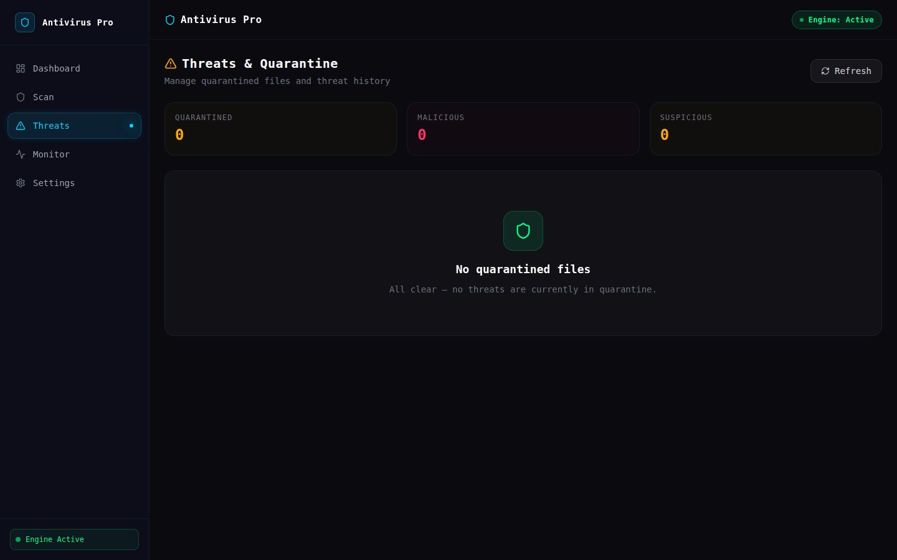
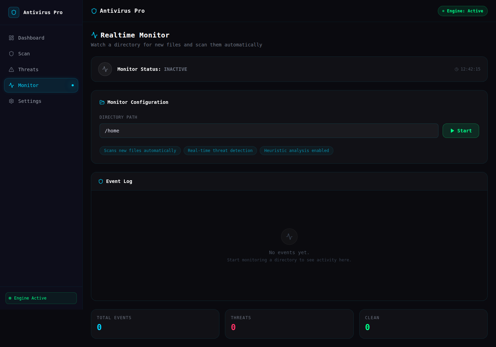
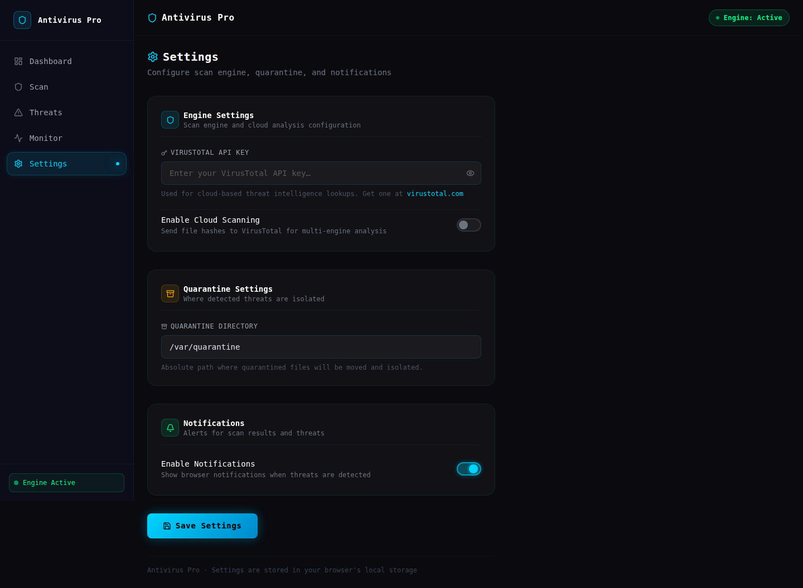

<div align="center">
  <h1>🛡️ ANTIVIRUS PRO</h1>
  <p><strong>Next-Generation Multi-Layered Cybersecurity Protection Platform</strong></p>

  

  <br/><br/>

  
  
  
  
  
  
</div>

---

## 📌 Overview

**Antivirus Pro** is a full-stack cybersecurity platform featuring a Rust-powered heuristic scan engine, a Python/FastAPI backend with VirusTotal & MetaDefender integration, and a real-time Next.js 15 SOC dashboard. Designed with a cyberpunk aesthetic, it delivers enterprise-grade threat detection with sub-millisecond analysis.

---

## ✨ Features

- 🔍 **Heuristic Engine** — Rust-based entropy scanning with `rayon` for parallel file analysis
- 🌐 **VirusTotal & MetaDefender Integration** — multi-engine cloud threat intelligence
- 📊 **Real-time SOC Dashboard** — WebSocket-powered live threat feed and system metrics
- 🔒 **Quarantine System** — automatic isolation of detected threats
- 📁 **File & Directory Scanner** — deep recursive scanning with customizable rules
- 🚨 **Threat Classification** — severity scoring (Critical / High / Medium / Low)
- 🗄️ **SQLite Persistence** — full scan history and threat log storage
- 🐳 **Docker-ready** — one-command deployment

---

## 🏗️ Architecture

```
┌─────────────────────────────────────────────┐
│           Next.js 15 SOC Dashboard          │  ← Real-time UI
│         (WebSocket + REST client)           │
└─────────────────┬───────────────────────────┘
                  │
┌─────────────────▼───────────────────────────┐
│         FastAPI Backend (Python)            │  ← API & Logic
│   VirusTotal │ MetaDefender │ SQLite        │
└─────────────────┬───────────────────────────┘
                  │
┌─────────────────▼───────────────────────────┐
│          Rust Heuristic Core                │  ← Scan Engine
│     rayon │ entropy │ signature matching    │
└─────────────────────────────────────────────┘
```

---

## 📸 Interface

<div align="center">
  
  
  
  
</div>

<div align="center">
  
  
  
  
  
</div>

---

## 🛠️ Tech Stack

| Layer | Technology |
|-------|-----------|
| Frontend | Next.js 15, TypeScript, Tailwind CSS, WebSocket |
| Backend | Python 3.11, FastAPI, SQLite, VirusTotal API |
| Scan Engine | Rust, rayon, sha2, serde |
| DevOps | Docker, Docker Compose, GitHub Actions |

---

## 🚀 Quick Start

### Prerequisites
- Docker & Docker Compose
- Rust (for local development)
- Python 3.11+
- Node.js 18+

### Run with Docker

```bash
git clone https://github.com/builtbysardor/antivirus-pro.git
cd antivirus-pro
cp .env.example .env   # Add your VirusTotal API key
make dev
```

App available at: `http://localhost:3000`

### Run Locally

```bash
# Install dependencies
make install

# Compile the Rust engine
make build-rust

# Start all services
make dev
```

---

## ⚙️ Configuration

```env
VIRUSTOTAL_API_KEY=your_api_key_here
METADEFENDER_API_KEY=your_api_key_here
DATABASE_URL=sqlite:///./antivirus.db
SCAN_THREADS=8
```

---

## 📡 API Endpoints

| Method | Endpoint | Description |
|--------|----------|-------------|
| `POST` | `/api/scan/file` | Scan a single file |
| `POST` | `/api/scan/directory` | Recursive directory scan |
| `GET` | `/api/threats` | List all detected threats |
| `POST` | `/api/quarantine/{id}` | Quarantine a threat |
| `GET` | `/api/stats` | Dashboard statistics |

---

## 📋 CI/CD

Automated testing and builds via GitHub Actions on every push to `main`.

---

## 📄 License

MIT © [Sardor Buriyev](https://github.com/builtbysardor)
