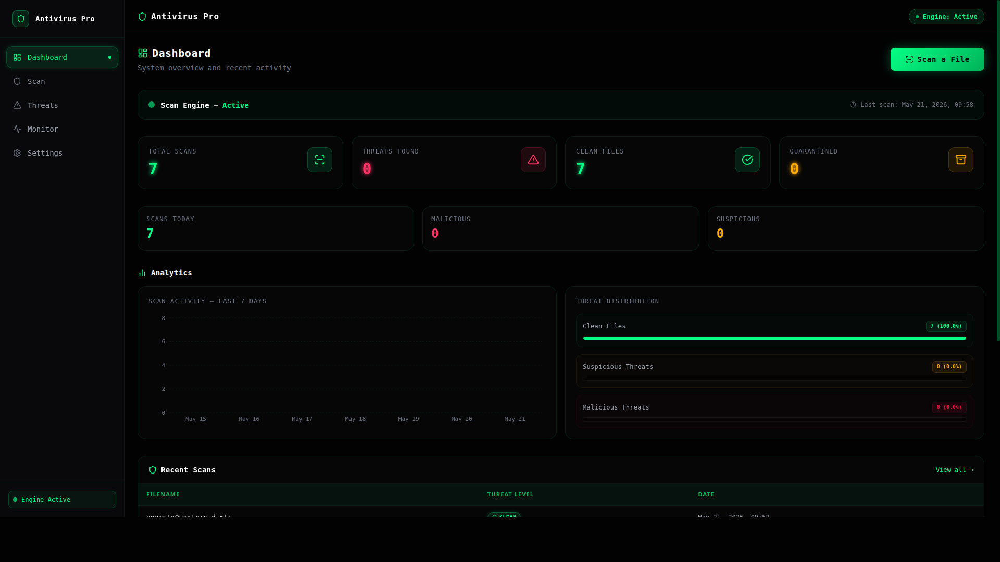

# Enterprise Antivirus Solution

A comprehensive, next-generation threat protection platform designed for enterprise environments.

## Overview

This Enterprise Antivirus Solution provides advanced, real-time protection against malware, ransomware, and zero-day threats. Built with performance and scalability in mind, it offers centralized management and deep visibility into endpoint security across the entire organizational network.

  

## Key Features

- **Real-Time Threat Detection:** Advanced heuristics and machine learning algorithms identify and neutralize threats instantaneously.
- **Centralized Management Console:** A single pane of glass for monitoring, policy enforcement, and reporting across all endpoints.
- **Minimal System Impact:** Optimized scanning engine ensures maximum protection without compromising system performance.
- **Automated Remediation:** Intelligent response capabilities automatically isolate compromised endpoints and rollback malicious changes.
- **Comprehensive Reporting:** Detailed analytics and compliance reporting tailored for enterprise security operations.

## Architecture

The solution utilizes a lightweight client-server architecture:

1.  **Endpoint Agent:** A low-footprint sensor deployed on user machines and servers.
2.  **Management Server:** Centralized hub for policy distribution, telemetry collection, and alert aggregation.
3.  **Threat Intelligence Cloud:** Continuous updates and global threat data integration.

## Installation

Refer to the `docs/deployment.md` guide for detailed installation instructions tailored to your infrastructure.

## Support

For technical assistance, please contact the enterprise support team or consult the documentation portal.
